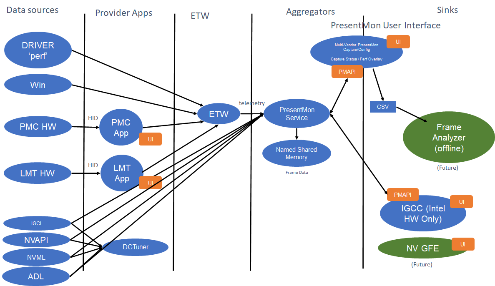
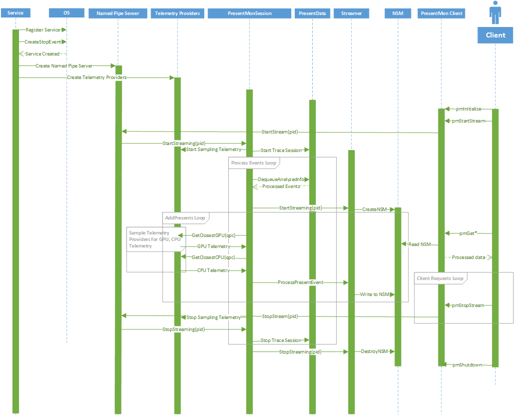

# PresentMon Service

**PresentMon Service** aggregates the ETW frame data of the **PresentMon Analysis library** with hardware telemetry measurements such as GPU temperature and power.  It exposes this information to client applications via the **PresentMon API**.  e.g., the [PresentMon Capture Application](README-CaptureApplication.md) is a *PresentMon Service* client. Applications should use the PresentMon SDK to communicate with the service via the PresentMon API.

# PresentMon SDK

## Getting Started

All installations of PresentMon Service from version 2.3.1 onwards will deploy PresentMonAPI2.dll together with the service during installation. Client applications should include the C header PresentMonAPI.h and dynamically load PresentMonAPI2.dll at runtime. If a client ships their own copy of PresentMonAPI2.dll, binary compatibility with the service will not be guaranteed.

We also provide a loader library to reduce the developer burden of manually loading the .dll and resolving endpoints. Applications using the loader can link to the PresentMonAPI2Loader.lib import library during build and deploy PresentMonAPI2Loader.dll with their application.

PresentMonAPI.h, PresentMonAPI2Loader.lib, and PresentMonAPI2Loader.dll are optionally installed together with the service, and can be found by default in Program Files\Intel\PresentMon\SDK.

## Diagnostics

All of the PresentMonAPI functions return an enum type PM_STATUS that indicates success/failure and can give a hint as to the cause of any failure. For more detailed diagnostic messages, refer to PresentMonDiagnostics.h found in the PresentMonAPI2 project directory.

# Failure recovery

The installer configures `PresentMonSharedService` so Windows starts it again after an abnormal process exit, then stops trying. The Recovery action is "Run a program", not "Restart the Service". Restart does not take a command line. The program is `sc.exe start PresentMonSharedService --recovery-fail-count %1%`. `%1%` is the failure-count placeholder SCM substitutes when it runs the command (the same placeholder the Recovery tab checkbox documents as `/fail=%1%`). `sc.exe start` passes `--recovery-fail-count N` through to the service. The command string is fixed at install time. The service does not register or rewrite it.

| Failure in the window | Action | Holdoff |
| --- | --- | --- |
| 1st | start with `--recovery-fail-count 1` | 2 seconds |
| 2nd | start with `--recovery-fail-count 2` | 15 seconds |
| 3rd | start with `--recovery-fail-count 3` | 60 seconds |
| 4th | start with `--recovery-fail-count 4` | 5 minutes |
| 5th and later | stay stopped | |

The failure count resets after 30 minutes with no failure. That reset does not start the service. A later start gets a fresh budget only after those 30 minutes have elapsed. A clean stop (`sc.exe stop`) does not count as a failure.

On a recovery start the service log contains `SCM recovery start, fail count N`. A normal start has no `--recovery-fail-count` argument and does not log that line.

An existing client session is not reconnected. The next API call on that handle returns `PM_STATUS_SESSION_NOT_OPEN`. Opening a new session after the service is back is the caller's responsibility.
